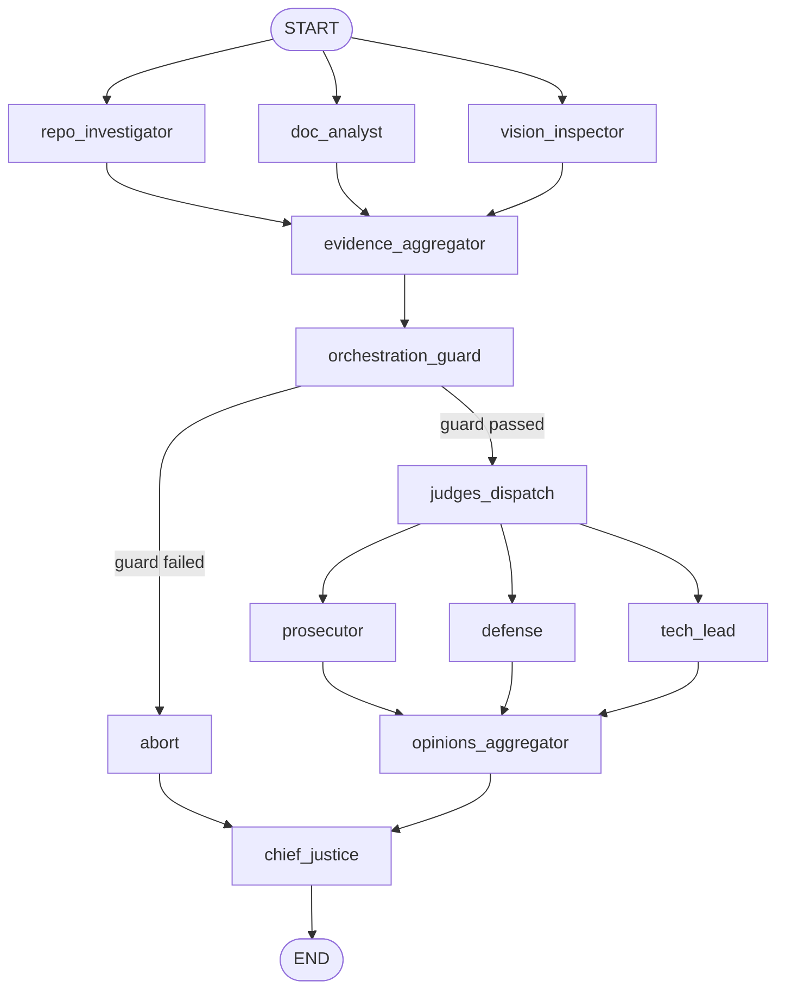

# Automation Auditor

Automation Auditor is a multi-agent, rubric-driven evaluation system that audits a GitHub repository and an architecture PDF, then produces a deterministic markdown report.

It combines parallel evidence collection, structured judge reasoning, and rule-based synthesis to reduce hallucination and improve consistency.

## Why this project exists

Traditional single-prompt grading is hard to trust for engineering evaluation. This project separates:

- Evidence collection (facts)
- Judicial interpretation (opinions)
- Final synthesis (deterministic rules)

The result is a more auditable and reproducible evaluation pipeline.

## System architecture

The runtime is a staged LangGraph workflow:

1. Detectives run in parallel and gather evidence.
2. Evidence is merged and validated.
3. Judges run in parallel per criterion.
4. Chief Justice applies deterministic synthesis rules.
5. A final markdown report is emitted.

### Execution diagram



## Core components

- Graph orchestration: [src/graph.py](src/graph.py)
- State contract and reducers: [src/state.py](src/state.py)
- Detective nodes: [src/nodes/detectives.py](src/nodes/detectives.py)
- Judge nodes: [src/nodes/judges.py](src/nodes/judges.py)
- Deterministic synthesis: [src/nodes/justice.py](src/nodes/justice.py)
- Runtime config and rubric validation: [src/config.py](src/config.py)
- CLI entrypoint: [src/run.py](src/run.py)

## Quick start

### 1) Install dependencies

```bash
uv sync
source .venv/bin/activate
```

### 2) Configure environment

```bash
cp .env.example .env
```

Required:

```bash
OPENAI_API_KEY=your_key_here
```

Optional:

```bash
OPENAI_MODEL=gpt-4o-mini
AUDITOR_OFFLINE_MODE=false
```

### 3) Run an audit

```bash
uv run python -m src.run \
  --repo <github_repo_url> \
  --pdf <path_to_pdf> \
  --out <output_markdown_path> \
  --rubric rubric/week2_rubric.json \
  --enable-vision
```

Offline deterministic mode (no LLM calls):

```bash
uv run python -m src.run \
  --repo <github_repo_url> \
  --pdf <path_to_pdf> \
  --out <output_markdown_path> \
  --rubric rubric/week2_rubric.json \
  --offline
```

## Makefile workflows

Standard:

```bash
make self_audit
make peer_audit
```

Timestamped archive outputs:

```bash
make self_audit_archive
make peer_audit_archive
```

Generated reports are written under:

- [audit/report_onself_generated](audit/report_onself_generated)
- [audit/report_onpeer_generated](audit/report_onpeer_generated)
- [audit/archive](audit/archive)

## LangSmith evidence checklist

Use this checklist to show completed tracing history in submissions:

1. Open https://smith.langchain.com and navigate to your project (`automation-audit`).
2. Filter runs by status `Success/Completed` and recent date range.
3. Capture one run trace showing full graph execution (detectives, judges, chief justice).
4. Include these proof items:
  - Project URL
  - One or more run URLs
  - Total run count and completed run count
  - Latest run timestamp

Required env settings for tracing:

```bash
LANGSMITH_TRACING=true
LANGSMITH_API_KEY=<your_key>
LANGSMITH_PROJECT=automation-auditor
```

## Rubric model

Rubric definitions are loaded from [rubric/week2_rubric.json](rubric/week2_rubric.json).

Validation enforces required dimension and synthesis-rule keys before execution, preventing malformed policy files from entering the pipeline.

## Production operations

### Runtime hardening

Container runtime includes:

- Pinned base image
- Non-root execution user
- Healthcheck
- Startup smoke command in entrypoint

See [Dockerfile](Dockerfile) and [scripts/container-entrypoint.sh](scripts/container-entrypoint.sh).

### Recommended SLOs

- Availability: 99.5% monthly
- Successful run rate: >= 98%
- P95 run latency: <= 5 minutes (medium repo + standard rubric)
- Startup/config failure rate: < 1%

### Common failure classes

- Missing/invalid environment variables
- Rubric schema validation failures
- Git clone/network/provider API failures
- Invalid input artifacts (repo URL/PDF)
- Provider quota or rate limits

### Incident triage

1. Verify container health and CI status.
2. Check startup smoke and runtime logs.
3. Validate env vars and rubric file.
4. Re-run in offline mode to isolate provider issues.
5. If offline passes and online fails, treat as external/provider incident.

## Development and quality

Run local quality checks:

```bash
uv run python -m ruff check .
uv run python -m pytest -q
```

CI runs lint, tests, CLI smoke, and Docker build/run checks via [ .github/workflows/ci.yml ](.github/workflows/ci.yml).

## Project status

Current implementation includes:

- Parallel detective and judge fan-out/fan-in architecture
- Typed state models with reducers
- Structured judicial outputs with guardrails
- Deterministic synthesis rules for final scoring
- Configurable runtime caps for payload/citation controls
- Offline deterministic execution mode

## License / usage

This repository is intended for educational and engineering evaluation workflows. Adapt the rubric and operations profile for your organization’s governance and compliance needs.
